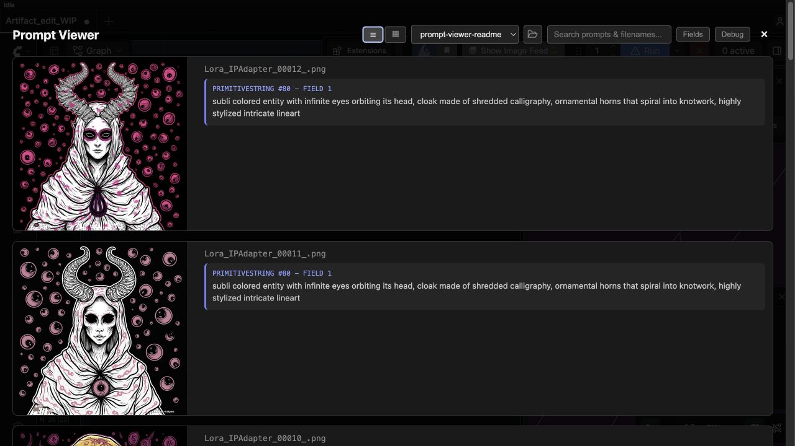

# ComfyUI Prompt Viewer

A full-screen ComfyUI output gallery for revisiting images and the text prompts embedded in their workflow metadata.

<p align="center"><a href="docs/screenshots/gallery.png"></a><a href="docs/screenshots/list.png"></a><a href="docs/screenshots/prompt-detail.png"></a></p>

## Features

- Grid and list views
- Prompt and filename search
- Output folder detection, hiding, and relative manual additions
- Keyboard image navigation
- Scan for and choose prompt fields
- Optional per-image hiding of selected fields whose nodes were bypassed
- Debug mode for inspecting text from active, muted, and bypassed nodes
- Native ComfyUI sidebar and command-palette integration

## Installation

### ComfyUI Manager

Open ComfyUI-Manager, search **Node Pack** for **Prompt Viewer**, select it, and click **Install**. Restart ComfyUI when installation completes.

### Manual installation

From your ComfyUI `custom_nodes` directory:

```bash
git clone https://github.com/Jasshl/ComfyUI-Prompt-Viewer.git
```

Restart ComfyUI after cloning. Use the **Prompt Viewer** sidebar icon to open the full gallery, or search for **Open Prompt Viewer** in ComfyUI's command palette. Older ComfyUI frontends receive a movable launcher instead.

## Prompt metadata

Prompt Viewer reads text fields from `workflow` metadata embedded in ComfyUI PNG files. By default, it shows longer text values from active nodes and skips values that look like filenames or model paths. Use **Fields > Scan for fields** to select exact fields, including shorter text values. The field picker hides inactive and technical configuration fields by default; both groups can be included from its filters. **Hide bypassed prompts in gallery** omits a selected field only on images where its node was bypassed.

## License

MIT
